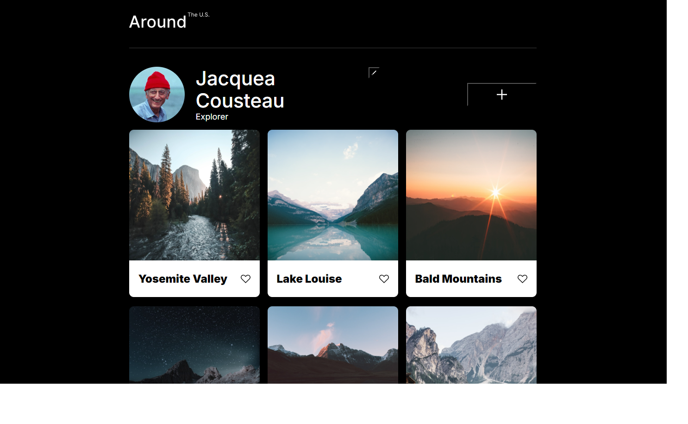
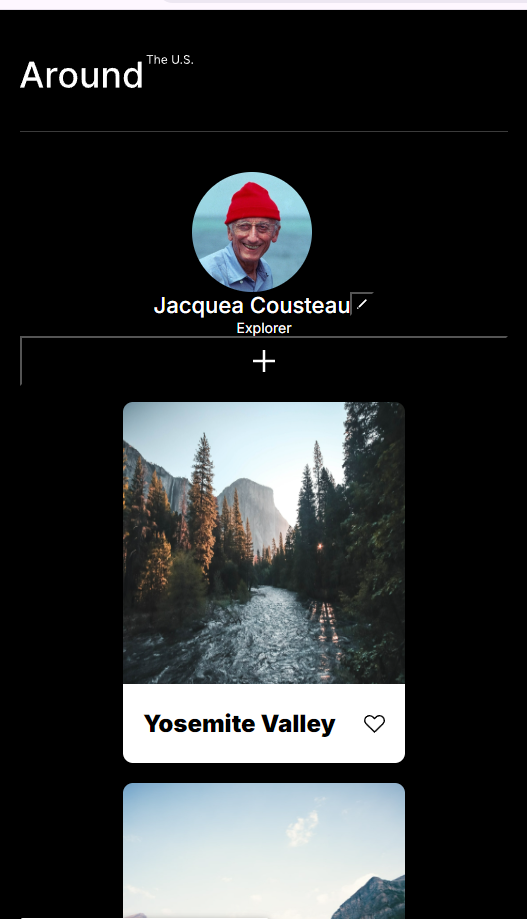

# Project 3: Around The U.S.

### Overview

- Intro
- Figma
- Images

**Intro**
The name of this project is Around the U.S. This project was made to display iconic places to visit around the U.S. It's functionality is demonstrated on the varity of screens sizes thats applicable. Technologies that were used are HTML and CSS. Techniques that were used are responsive design and BEM naming guidelines.

**Figma**

- [Link to the project on Figma](https://www.figma.com/file/ii4xxsJ0ghevUOcssTlHZv/Sprint-3%3A-Around-the-US?node-id=0%3A1)

**Images**
.

**Project 3 video link**
https://drive.google.com/file/d/1H_QdcbV55uGGWfns1EbFWW4rzV_dCm5e/view?usp=sharing

**Link to Github pages**
https://maurice284.github.io/se_project_aroundtheus/
